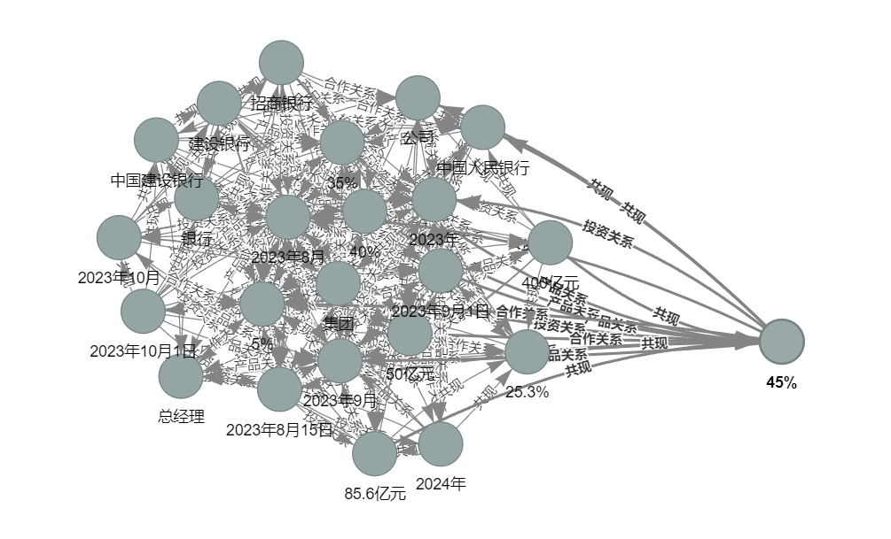
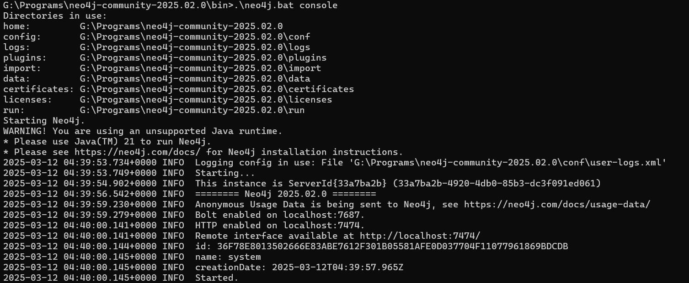

# 金融知识图谱系统
[🇨🇳 中文](README.md) | [🇺🇸 English](README_EN.md)
## 项目简介
本项目是一个基于自然语言处理的金融知识图谱构建系统，能够从金融文本中自动抽取实体、关系和事件，构建金融领域的知识图谱。系统支持将结果导出为交互式HTML文件或存储到Neo4j图数据库中。

## 系统特色
- **模块化设计**：系统采用高度模块化的设计，各个组件可以独立使用和扩展
- **多样化方法**：集成了规则、机器学习等多种方法，可根据具体需求选择
- **双重存储**：支持HTML可视化和Neo4j数据库存储两种方式
- **可视化展示**：提供知识图谱的可视化功能，直观展示知识结构

## 技术架构
系统的核心组件位于 `src/utils/nlp/` 目录下：
- `entity_extractor.py`: 实体抽取模块(https://github.com/EasonWong0327/NLP-NER 这个更详细)
- `relation_extractor.py`: 关系抽取模块
- `event_extractor.py`: 事件抽取模块
- `temporal_analyzer.py`: 时间信息分析模块
- `entity_linker.py`: 实体链接模块
- `knowledge_graph.py`: 知识图谱管理模块

## 快速开始

### 1. 环境配置

1. 克隆项目并进入目录
```bash
git clone https://github.com/EasonWong0327/NLP-Knowledge_Graph.git
cd NLP-Knowledge_Graph
```

2. 创建虚拟环境
```bash
conda create -n kg python=3.8
conda activate kg
```

3. 安装依赖
```bash
pip install -r requirements.txt
```

### 2. 可视化方式

#### 方式一：HTML可视化
使用 `quick_start_export_to_html.py` 生成交互式HTML文件：

```python
python quick_start_export_to_html.py
```

特点：
- 生成可交互的知识图谱可视化页面
- 支持节点拖拽、缩放和搜索
- 自动保存为HTML文件，可直接在浏览器中打开
- 支持自定义节点颜色和关系样式




#### 方式二：Neo4j数据库存储
使用 `quick_start_export_to_neo4j.py` 将数据导入Neo4j：

1. 配置Neo4j连接信息
在项目根目录创建 `.env` 文件：
```bash
NEO4J_URI=bolt://localhost:7687
NEO4J_USER=neo4j
NEO4J_PASSWORD=your_password  # 替换为你的密码
```

2. 运行导出脚本
```python
python quick_start_export_to_neo4j.py
```

特点：
- 支持批量导入实体和关系
- 自动创建索引优化查询
- 提供数据库统计信息
- 支持增量更新
  

### 3. 示例数据

系统可以处理如下格式的金融新闻文本：
```text
【投资合作】2023年8月15日，阿里巴巴集团宣布与蚂蚁集团达成战略合作协议...
【产品发布】2023年9月1日，腾讯金融科技发布新一代智能风控系统"腾盾"...
【人事变动】2023年10月1日，中国建设银行宣布王建平出任首席风险官...
```

可以抽取的信息包括：
- **实体**：公司（阿里巴巴、蚂蚁集团）、产品（腾盾）、人物（王建平）等
- **关系**：投资关系、合作关系、任职关系等
- **时间**：具体的时间点和时间段
- **事件**：投资事件、产品发布、人事变动等


## 常见问题

1. Neo4j安装连接问题
- 下载地址：https://neo4j.com/deployment-center/
- 下载Neo4j.zip安装包，解压，需要Java环境，进入bin目录，Windows执行：`.\neo4j.bat console` ,确保Neo4j服务已启动
- 配置用户名和密码，第一次进入页面，需要输入用户名密码neo4j/neo4j，并且需要设置新密码
- 检查防火墙设置
  
- 
2. 可视化问题
- 如果节点太多，可以增加画布大小
- 调整节点间距和斥力参数
- 使用筛选功能减少显示的节点数量

3. 数据问题
- 确保输入文本格式规范，最好包含明确的分类标签（如【投资合作】）
- 对于大规模文本，建议分批处理

## 贡献指南
欢迎提交Issue和Pull Request。

## 许可证
MIT License

## 引用
如果您使用了本项目的代码，请引用：
```bibtex
@misc{Knowledge_Graph,
  author = {EasonWong0327},
  title = {Knowledge Graph System},
  year = {2025},
  publisher = {GitHub},
  url = {https://github.com/EasonWong0327/NLP-Knowledge_Graph}
}
``` 
