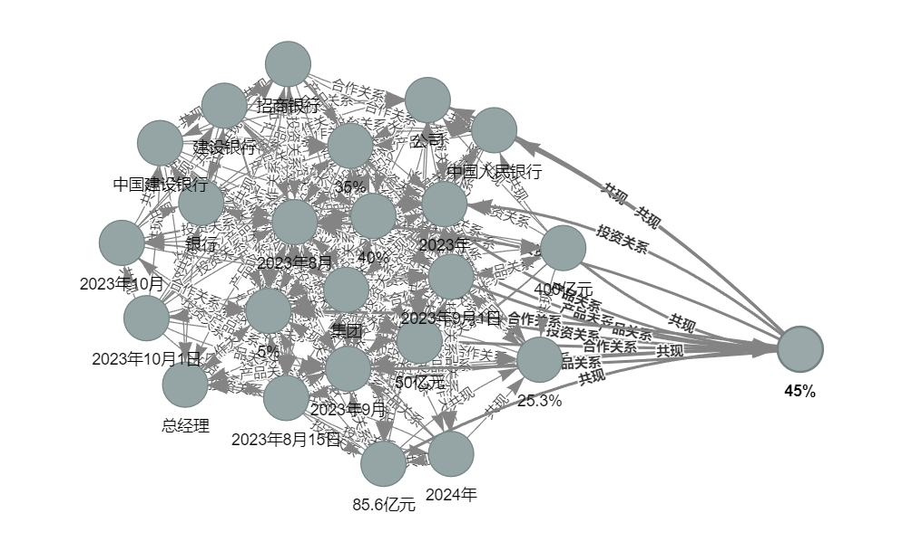
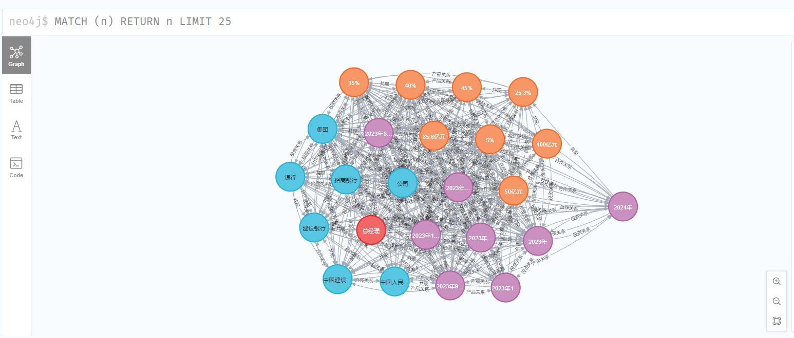
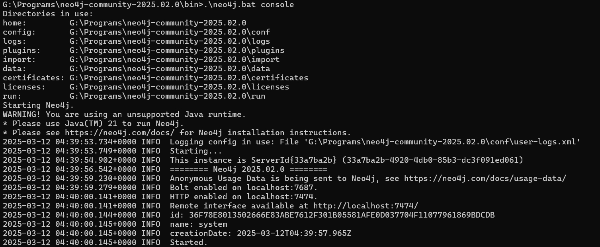

# Financial Knowledge Graph Construction System
[🇨🇳 Chinese](README.md) | [🇺🇸 English](README_EN.md)

## Project Overview
This project is a financial knowledge graph construction system based on natural language processing, capable of automatically extracting entities, relationships, and events from financial texts to build a knowledge graph in the financial domain. The system supports exporting results as interactive HTML files or storing them in a Neo4j graph database.

## System Features
- **Modular Design**: The system adopts a highly modular design where each component can be used and extended independently
- **Diverse Methods**: Integrates multiple approaches including rules and machine learning, allowing selection based on specific needs
- **Dual Storage**: Supports both HTML visualization and Neo4j database storage
- **Visual Presentation**: Provides knowledge graph visualization functionality for intuitive knowledge structure display

## Technical Architecture
The core components are located in the `src/utils/nlp/` directory:
- `entity_extractor.py`: Entity extraction module (more details at https://github.com/EasonWong0327/NLP-NER)
- `relation_extractor.py`: Relationship extraction module
- `event_extractor.py`: Event extraction module
- `temporal_analyzer.py`: Temporal information analysis module
- `entity_linker.py`: Entity linking module
- `knowledge_graph.py`: Knowledge graph management module

## Quick Start

### 1. Environment Setup

1. Clone the project and enter directory
```bash
git clone https://github.com/EasonWong0327/NLP-Knowledge_Graph.git
cd NLP-Knowledge_Graph
```

2. Create virtual environment
```bash
conda create -n kg python=3.8
conda activate kg
```

3. Install dependencies
```bash
pip install -r requirements.txt
```

### 2. Visualization Methods

#### Method One: HTML Visualization
Use `quick_start_export_to_html.py` to generate an interactive HTML file:

```python
python quick_start_export_to_html.py
```

Features:
- Generates interactive knowledge graph visualization page
- Supports node dragging, zooming, and searching
- Automatically saves as HTML file, viewable directly in browser
- Supports custom node colors and relationship styles



#### Method Two: Neo4j Database Storage
Use `quick_start_export_to_neo4j.py` to import data into Neo4j:

1. Configure Neo4j connection information
Create a `.env` file in the project root directory:
```bash
NEO4J_URI=bolt://localhost:7687
NEO4J_USER=neo4j
NEO4J_PASSWORD=your_password  # Replace with your password
```

2. Run the export script
```python
python quick_start_export_to_neo4j.py
```

Features:
- Supports batch import of entities and relationships
- Automatically creates indexes for query optimization
- Provides database statistics
- Supports incremental updates


### 3. Sample Data

The system can process financial news text in the following format:
```text
[Investment Cooperation] August 15, 2023, Alibaba Group announced a strategic cooperation agreement with Ant Group...
[Product Launch] September 1, 2023, Tencent Financial Technology launched a new generation intelligent risk control system "TenShield"...
[Personnel Change] October 1, 2023, China Construction Bank announced Wang Jianping as Chief Risk Officer...
```

Information that can be extracted includes:
- **Entities**: Companies (Alibaba, Ant Group), Products (TenShield), People (Wang Jianping), etc.
- **Relationships**: Investment relationships, cooperation relationships, employment relationships, etc.
- **Time**: Specific time points and periods
- **Events**: Investment events, product launches, personnel changes, etc.

## Common Issues

1. Neo4j Installation and Connection Issues
- Download link: https://neo4j.com/deployment-center/
- Download Neo4j.zip package, extract it, requires Java environment, enter bin directory, for Windows execute: `.\neo4j.bat console`, ensure Neo4j service is running
- Configure username and password, first-time access requires username/password neo4j/neo4j, and needs to set a new password
- Check firewall settings


2. Visualization Issues
- If there are too many nodes, increase canvas size
- Adjust node spacing and repulsion parameters
- Use filtering functionality to reduce the number of displayed nodes

3. Data Issues
- Ensure input text format is standardized, preferably including clear category tags (e.g., [Investment Cooperation])
- For large-scale texts, process in batches

## Contributing
Issues and Pull Requests are welcome.

## License
MIT License

## Citation
If you use code from this project, please cite:
```bibtex
@misc{Knowledge_Graph,
  author = {EasonWong0327},
  title = {Knowledge Graph System},
  year = {2025},
  publisher = {GitHub},
  url = {https://github.com/EasonWong0327/NLP-Knowledge_Graph}
}
``` 